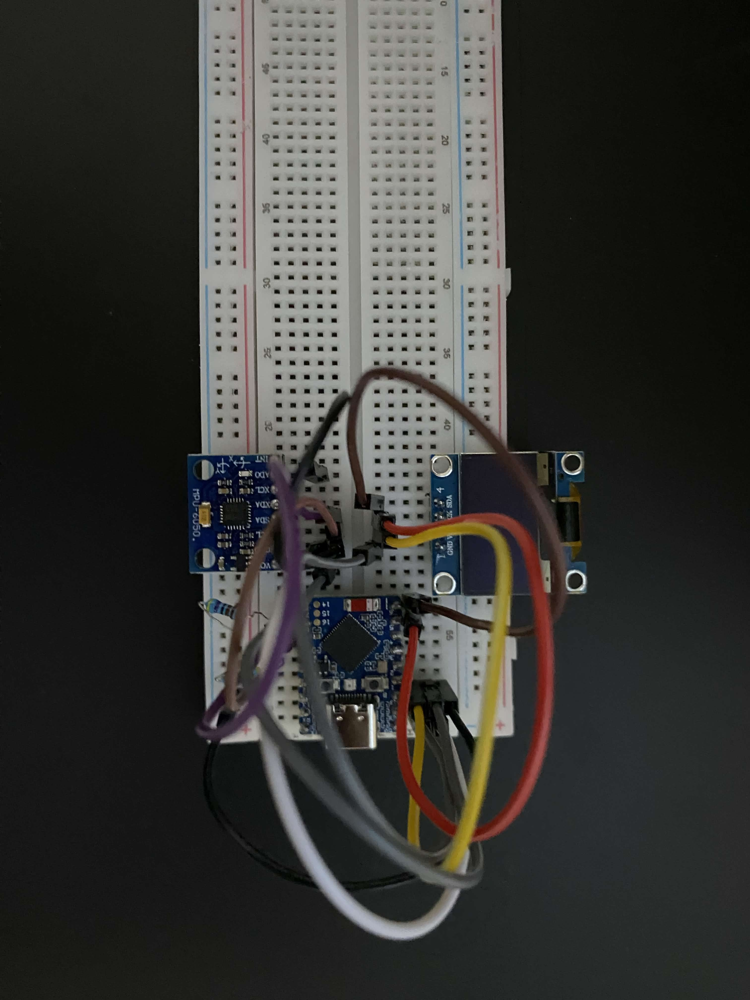
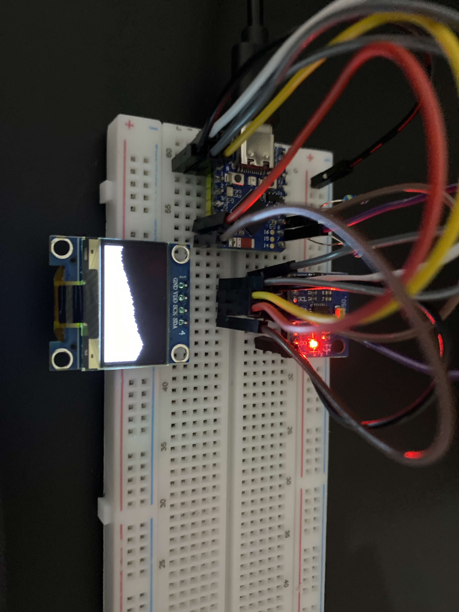

# Sand Drift

## Overview

Sand Drift is a handheld embedded device that simulates granular particles reacting to gravity based on device orientation. The system uses an ESP32-S3-Zero-Mini microcontroller, an MPU6050 IMU for motion sensing, and an SSD1306 OLED display for rendering.

The goal of the project was to implement a real-time physics-like simulation on a resource-limited microcontroller while interfacing with external sensors and maintaining smooth visual output.

## Hardware

* ESP32-S3-Zero-Mini
* MPU6050 accelerometer/gyroscope (I2C)
* SSD1306 OLED display (I2C)
* Breadboard prototype

## Technical Challenges

### 1. Sensor Noise

The MPU6050 readings fluctuate significantly when stationary. Raw acceleration values caused unstable particle movement.
Solution: averaged readings and applied smoothing to produce stable gravity direction.

### 2. Limited Processing Power

The ESP32 must:

* read sensor data
* update hundreds/thousands of particles
* redraw the display

Updating too many particles caused frame drops.
Solution: optimized update order and limited per-frame particle calculations.

### 3. Display Constraints

The SSD1306 has a slow refresh rate and a small buffer. Writing pixels individually was too slow.
Solution: buffered screen updates and minimized redraw operations.

### 4. Timing

Fast loops caused inconsistent physics behavior depending on frame rate.
Solution: stabilized update timing and decoupled physics update from sensor reading.

## What I Learned

* Real-time programming on constrained hardware
* I2C communication debugging
* Reading sensor datasheets and interpreting register data
* Performance optimization on microcontrollers

## Design Improvements / Future Work

**Sensor Choice**
The MPU6050 requires external pull-up resistors for I2C and produces noticeable noise when stationary. A newer IMU with better onboard filtering and integrated pull-ups would simplify wiring and reduce signal instability.

**Physics Accuracy**
The current simulation uses integer-based particle movement for performance reasons. Using floating-point velocity and acceleration would allow smoother motion and more realistic particle behavior, at the cost of additional CPU usage.

**Display Limitations**
The SSD1306 resolution and refresh speed limit visual detail and frame rate. A higher resolution or faster display (such as SPI-driven TFT) would significantly improve visual quality and allow more particles to be simulated.

**Mechanical Design**
The current prototype is breadboard-based. A custom PCB and enclosure would improve reliability, reduce wiring noise, and make the device portable.

## Images

